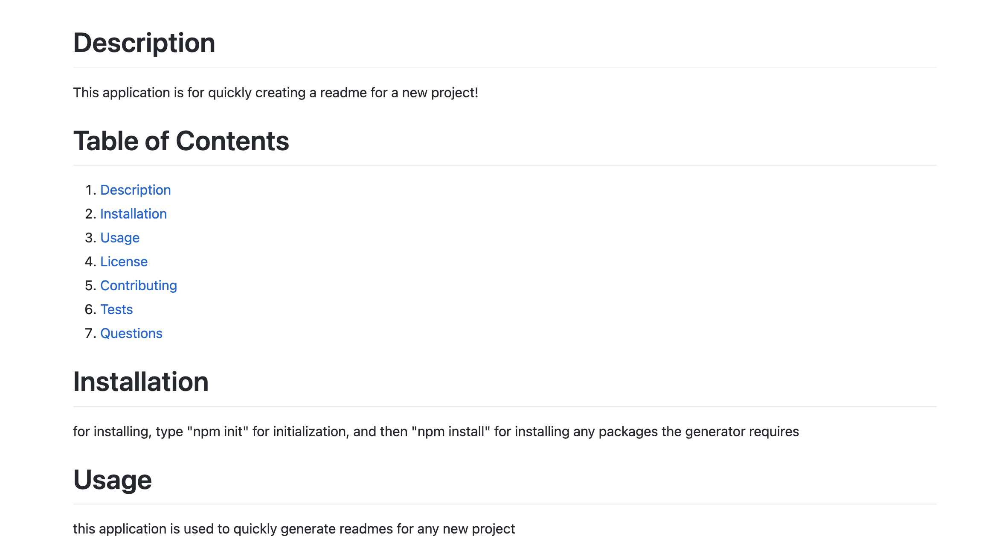
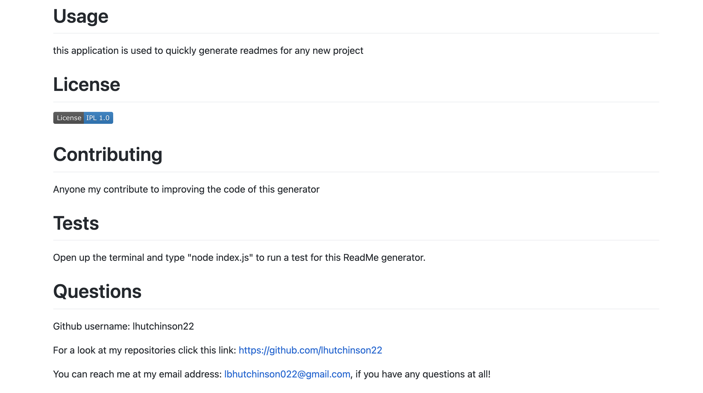

# README Generator

 This generator makes it easy to create a README file by using a command-line application. The purpose of this is so that the project creator can spend less time on the README and more time actually coding for the project itself. Technologies used include Javascript and Node.js

# Project Details

For details, and a video walkthrough of the application, click on the Develop Folder.

# Images of application

